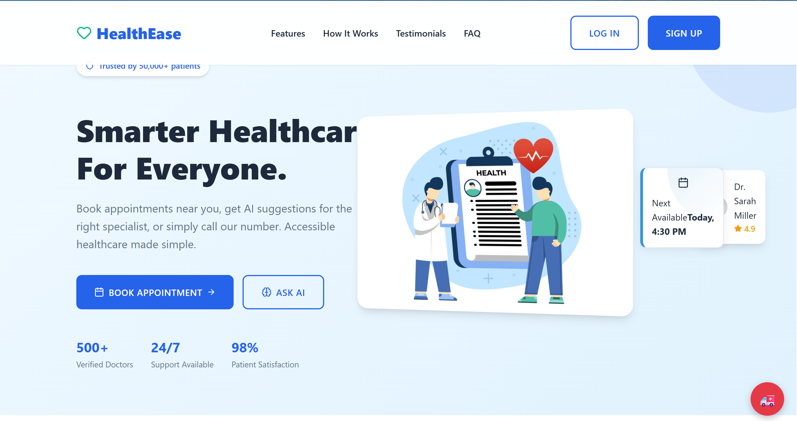
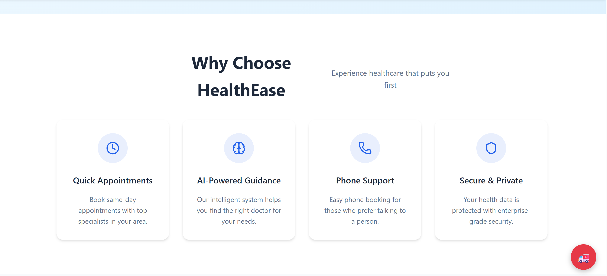
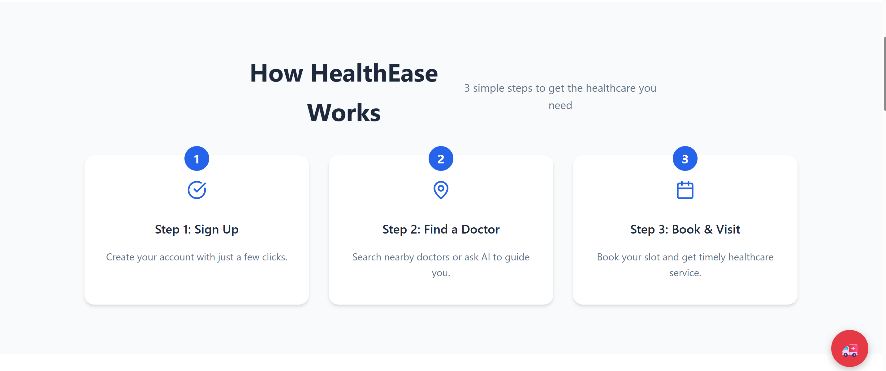
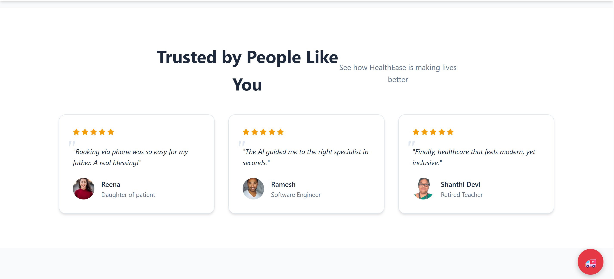
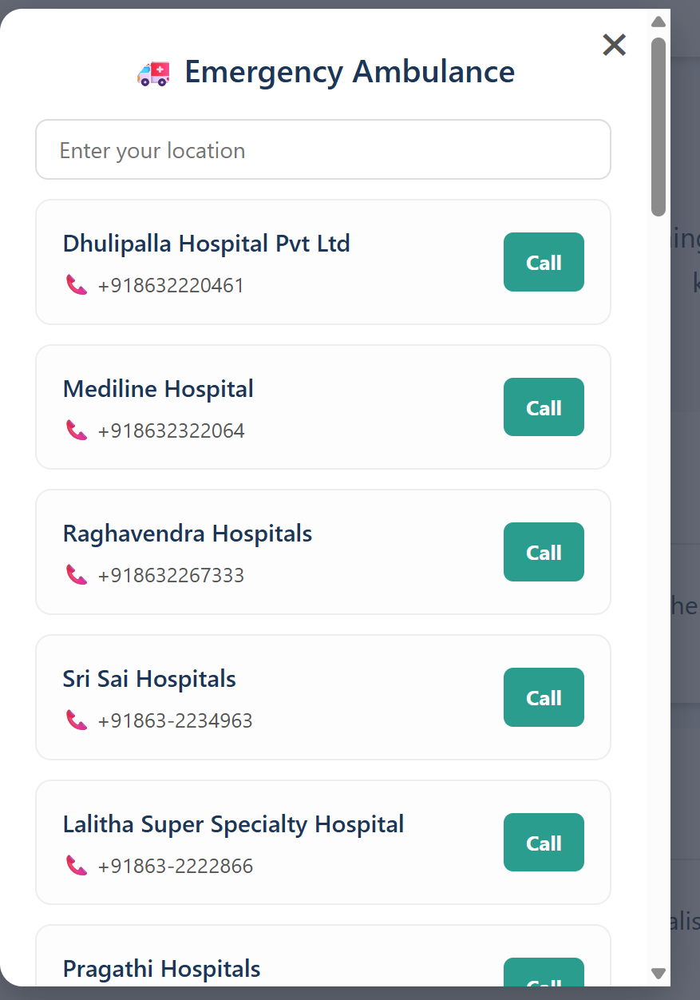
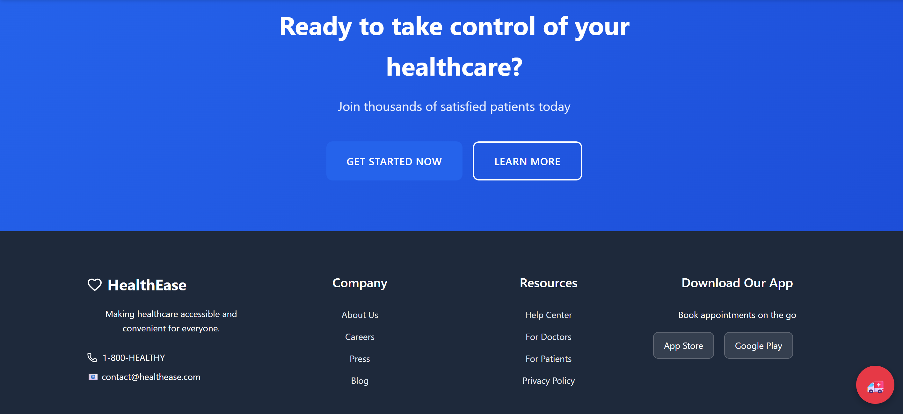

<meta property="og:title" content="HealthEase — AI Powered Medical Assistance Platform" />
<meta property="og:description" content="Award-winning MedTech platform with AI symptom analysis, calling agents, emergency support, and smart healthcare automation." />
<meta property="og:image" content="https://raw.githubusercontent.com/karthiksai2000/HealthEase-AI/main/assets/screenshots/banner.png" />
<meta property="og:type" content="website" />
<meta property="og:url" content="https://github.com/karthiksai2000/HealthEase-AI" />
<meta name="twitter:card" content="summary_large_image" />

# **HealthEase — AI Powered Medical Assistance Platform**

### 🏆 *Winner — Smart India Hackathon Internal Round & Project Expo (1st Prize among 60 teams)*

### 🌐 Live Demo: **[https://healthease-632g.onrender.com/](https://healthease-632g.onrender.com/)**

### 📺 YouTube Demo: **[https://www.youtube.com/watch?v=Gttzyv2Nr-A](https://www.youtube.com/watch?v=Gttzyv2Nr-A)**

### 🔊 Voice Assistant Audio: **[Google Drive](https://drive.google.com/file/d/1l8-ql_AvB1rkWiFYEXWB1IYXtEByCgOM/view)**


## 🚀 **Overview**

**HealthEase** is an AI-Powered MedTech platform designed to simplify healthcare access for everyone — from finding doctors to booking emergency ambulances with a single click.
The platform combines **AI models**, **Voice Calling Agents**, a **Python Backend**, **SQLite + PostgreSQL Databases**, and a modern **React frontend** to deliver a seamless healthcare experience.

Built for Smart India Hackathon style problem statements, and battle-tested in real competitions — where it won **first place twice**.

---

## ✨ **Key Features**

### 🧠 AI-Powered Health Assistant

* Suggests the right doctor based on symptoms
* Understands natural language
* Fast, accurate, and real-time

### 📞 Calling & Voice Agents

* Auto-calling system (Twilio-like)
* Reads doctor availability
* Can connect patients instantly

### 🏥 Emergency Ambulance Locator

* Search nearby hospitals
* One-click "Call" button
* Dynamic list powered by backend

### 📅 Smart Appointment Booking

* Find doctors by specialization
* Real-time schedule & slots
* Smooth booking workflow

### 🔐 Secure Patient Data

* Encrypted storage
* Token-based authentication
* No exposed sensitive info

---

# 📸 **UI Screenshots**

<p align="center"></p>
<p align="center"></p>
<p align="center"></p>
<p align="center"></p>
<p align="center"></p>
<p align="center"></p>

---

# 🏗 **System Architecture**

```
Frontend (React)
     ↓
REST API (Python FastAPI / Flask)
     ↓
AI Models (Symptom → Doctor mapping)
     ↓
SQLite (Local) + PostgreSQL (Cloud)
     ↓
Calling Agent (Telephony API)
```


---

# 🗂 **ER Diagram (Database Design)**

```
USER ───────< APPOINTMENT >────── DOCTOR
  │                                  │
  └──────< FEEDBACK >──────┘         │
                                      └── SPECIALIZATION
```

<p align="center">
  
</p>

---

# 📡 **API Documentation**

## 🔹 **Auth APIs**

| Method | Endpoint         | Description         |
| ------ | ---------------- | ------------------- |
| POST   | `/auth/register` | Create new user     |
| POST   | `/auth/login`    | Login and get token |

---

## 🔹 **Doctor APIs**

| Method | Endpoint                        | Description             |
| ------ | ------------------------------- | ----------------------- |
| GET    | `/doctors`                      | Get list of all doctors |
| GET    | `/doctors/{id}`                 | Get doctor details      |
| GET    | `/doctors/specialization/{key}` | Filter doctors          |

---

## 🔹 **Appointments API**

| Method | Endpoint                  | Description         |
| ------ | ------------------------- | ------------------- |
| POST   | `/appointments/book`      | Book appointment    |
| GET    | `/appointments/user/{id}` | User's appointments |
| DELETE | `/appointments/{id}`      | Cancel appointment  |

---

## 🔹 **Ambulance / Emergency**

| Method | Endpoint               | Description            |
| ------ | ---------------------- | ---------------------- |
| GET    | `/emergency/hospitals` | Fetch nearby hospitals |
| GET    | `/emergency/call/{id}` | Trigger call           |

---

# ⚙️ **Tech Stack**

### 🖥 Frontend

* ReactJS
* Tailwind / CSS
* Axios
* Clean surgical UI

### 🧪 Backend

* Python
* FastAPI / Flask
* SQLAlchemy
* JWT authentication

### 🧠 AI / ML

* Custom symptom–doctor model
* Pre-trained embeddings
* Vector similarity model

### 🗄 Database

* SQLite (Local Dev)
* PostgreSQL (Cloud Deploy – Render)

### 📞 Calling

* Twilio-like API integration

---

# 🏆 **What Makes HealthEase Special?**

### ✔ Real AI — Not Hardcoded

### ✔ Real telephony system

### ✔ Real database + cloud deployment

### ✔ Enterprise-grade UI

### ✔ End-to-end working product

### ✔ Award-winning implementation

---

# 🛠 **Installation**

```
git clone https://github.com/YOUR_USERNAME/HealthEase.git
cd HealthEase
```

### Backend Setup

```
cd backend
pip install -r requirements.txt
uvicorn main:app --reload
```

### Frontend Setup

```
cd frontend
npm install
npm start
```

---

# 🧪 **Run AI Models**

```
python ai/predict.py
```

---

# 🚀 **Deployment**

### Hosted on Render

Backend + PostgreSQL
Frontend on Static Hosting

---

# 🤝 **Contributing**

Pull requests are welcome!
For major changes, open an issue first.

---

# 📄 **License**

MIT License © 2025 HealthEase Team

