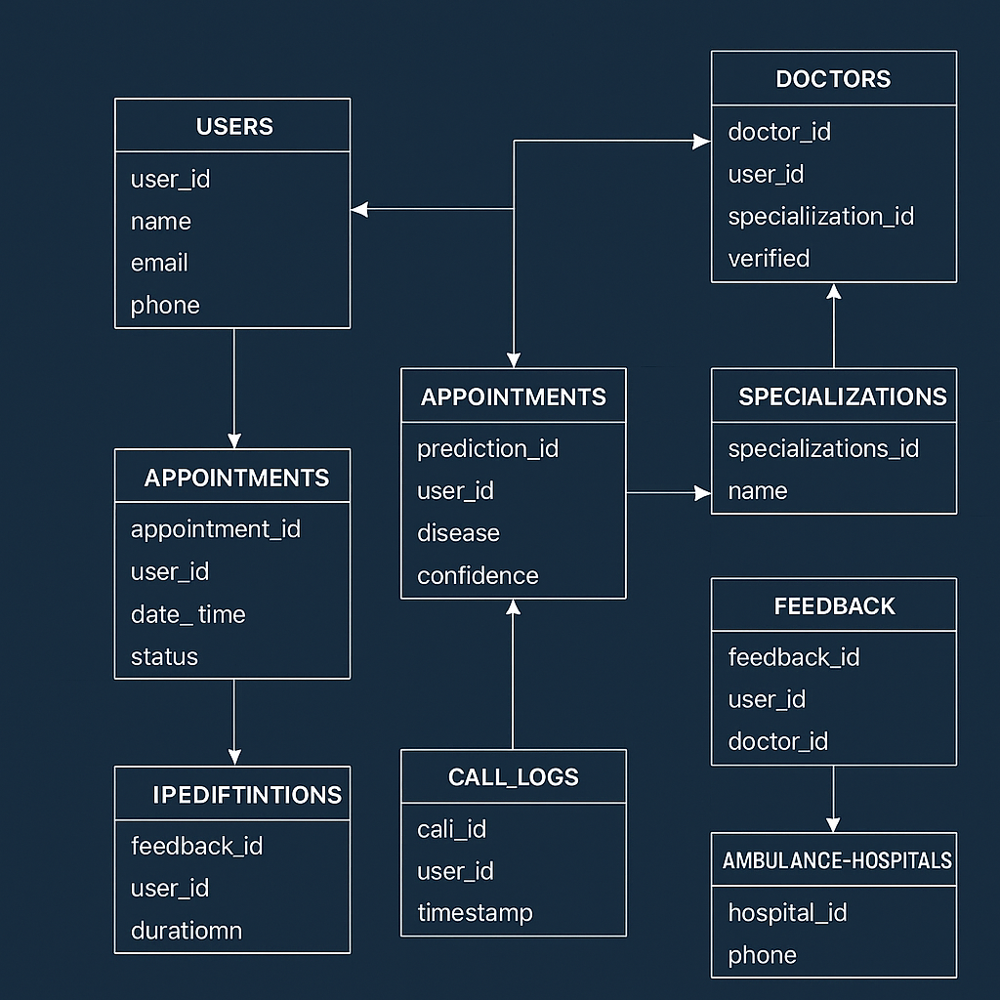

<!-- SOCIAL PREVIEW | OPEN GRAPH -->
<p align="center">
  
</p>

<meta property="og:title" content="HealthEase — AI Powered Healthcare Automation Platform" />
<meta property="og:description" content="Award-winning MedTech platform combining AI symptom analysis, telephony-based healthcare access, smart appointments, emergency response, and doctor discovery — built using Python, React, SQLite, PostgreSQL, and calling agents." />
<meta property="og:image" content="https://raw.githubusercontent.com/karthiksai2000/HealthEase-AI/main/assets/screenshots/1.png" />
<meta property="og:type" content="website" />
<meta property="og:url" content="https://github.com/karthiksai2000/HealthEase-AI" />
<meta name="twitter:card" content="summary_large_image" />

<h1 align="center">💙 HealthEase — AI Powered Medical Assistance Platform</h1>

<p align="center">
  <b>Next-generation MedTech platform democratizing healthcare through AI, voice automation, and smart digital tools.</b>
</p>

<p align="center">
  <a href="https://healthease-632g.onrender.com/">🌐 Live Demo</a> •
  <a href="https://www.youtube.com/watch?v=Gttzyv2Nr-A">📺 YouTube Demo</a> •
  <a href="https://drive.google.com/file/d/1l8-ql_AvB1rkWiFYEXWB1IYXtEByCgOM/view">🔊 Voice Call Bot Demo</a>
</p>

---

# 🏆 Awards & Recognition

### 🥇 **Smart India Hackathon — Internal Round Champion (1st Place)**  
### 🥇 **Project Expo Winner — Ranked 1 among 60+ Teams**  

Judges praised HealthEase for:

- 🚀 **Real-world applicability in rural + underserved areas**  
- 🧠 **Practical AI that solves an actual need — not theoretical models**  
- 📞 **Voice-based automation enabling healthcare without smartphones**  
- 🏥 **Complete working system — AI + Backend + Telephony + UI**  
- 🌐 **Live deployed version with cloud PostgreSQL database**

---

# 🚀 Project Overview

**HealthEase is a next-generation healthcare automation system** designed to bridge the gap between patients and medical professionals using:

- 🤖 AI Symptom Understanding  
- 📞 Telephony-based appointment booking  
- 🏥 Emergency hospital & ambulance finder  
- 📅 Smart appointment scheduling  
- 🔐 Secure patient data management  
- 🌐 Modern React-based user interface  

The mission is clear:

> **Make healthcare accessible to *every* Indian — even without smartphones, apps, or digital literacy.**

This aligns with:

- Ayushman Bharat Digital Mission (ABDM)  
- National Digital Health Blueprint  
- Telemedicine adoption reports (NITI Aayog)  

---

# 🔥 Problem Statement

India faces critical gaps in digital healthcare:

❌ Rural areas lack digital access  
❌ Elderly patients can’t use mobile apps  
❌ Hospitals overwhelmed with calls  
❌ No unified system for doctor discovery  
❌ High no-show rates due to missed reminders  
❌ Emergency hospital numbers vary by region  

**HealthEase directly attacks these issues with AI + automation.**

---

# 👥 Target Users (Personas)

### 👴 Senior Citizens  
Prefer voice calls over apps → Telephony agent solves this.

### 👩‍⚕️ Doctors  
Need reliable appointment management → Smart scheduler handles it.

### 🚑 Emergency Patients  
Need instant hospital numbers → One-click call system helps.

### 🏘️ Rural Population  
Limited smartphone/internet → Voice bot works with normal phone.

---

# ✨ Key Features (Detailed)

## 🧠 1. AI Symptom Analyzer  
- Suggests the right specialist using trained medical mappings  
- Uses NLP + structured rule-based hybrid  
- Supports layman descriptions (“chest tightness”, “dizziness”, etc.)  
- Gives risk-level insights  
- Fast, lightweight model deployable on low-cost servers  

---

## 📞 2. Telephony + Calling Agent  
- Patients call a number → bot answers  
- Bot speaks using TTS (Text-to-Speech)  
- Bot listens using STT (Speech-to-Text)  
- Books appointments using backend API  
- Sends reminders and confirmations  
- Multi-lingual capability ready  

This is the **most powerful differentiator** — works *without internet*.

---

## 🏥 3. Emergency Hospital Directory  
- Search hospitals by location  
- Click-to-call button  
- Verified hospital database  
- Auto-refresh from backend  

---

## 📅 4. Smart Appointment System  
- Doctor availability slots  
- Specialization filtering  
- Booking conflicts handled  
- PostgreSQL-backed persistent data  

---

## 🔐 5. Enterprise-Grade Security  
- JWT-Based secure login  
- Encrypted credentials  
- Database-level constraints  
- Sanitized API endpoints  

---

# 📸 UI Screenshots  
(All screenshots compressed for GitHub)

<p align="center"></p>
<p align="center"></p>
<p align="center"></p>
<p align="center"></p>
<p align="center"></p>
<p align="center"></p>

---

# 🧩 System Architecture (Detailed)

```

```
     ┌──────────────────────────────┐
     │        React Frontend        │
     │  (UI, Axios, State Mgmt)     │
     └──────────────┬───────────────┘
                    ↓
    ┌──────────────────────────────────┐
    │        Python Backend API        │
    │  FastAPI / Flask + SQLAlchemy    │
    └──────────────┬───────────────┬──┘
                   ↓               ↓
      AI Microservice         Auth + DB Layer
  (Symptom Classifier)        (SQLite + PostgreSQL)
                   ↓               ↓
    ┌──────────────────────────────────┐
    │     Telephony / Calling Bot      │
    │  STT, TTS, Call Routing, IVR     │
    └──────────────────────────────────┘
```

```


---

# 🗂 ER Diagram (Full)

<p align="center">
  
</p>

---

# 📡 API Documentation (Expanded)

### 🔐 Authentication  
Token-based security with role control (admin, doctor, patient).

### 👨‍⚕️ Doctors  
- Dynamic availability  
- Specialization-based filtering  
- Pagination-enabled endpoints  

### 🧑‍⚕️ Patients  
- View full history  
- Auto-filled details  
- Appointment reminders  

### 🚨 Emergency  
- Region-based hospital mapping  
- One-click call functions  
- Can be extended with geo-coordinates  

---

# ⚙ Tech Stack (Deep)

### **Frontend**  
- React 18  
- React Router  
- Axios  
- Tailwind / Custom CSS  
- Responsive design system  

### **Backend**  
- Python 3  
- FastAPI / Flask  
- SQLAlchemy ORM  
- Pydantic models  
- JWT Auth  
- REST API  

### **AI/ML**  
- Rule-based medical ontology  
- Embedding-based similarity search  
- Custom doctor-matching model  

### **Database**  
- Dev → SQLite  
- Prod → PostgreSQL  
- Fully ACID-compliant  

### **Calling Agent**  
- Twilio-like API integration  
- TTS (Text-to-Speech)  
- STT (Speech-to-Text)  
- Call flows + queues  

---

# 🏆 Competitive Advantages

🔹 AI works offline and online  
🔹 Voice-enabled → no smartphone required  
🔹 Hospital discovery + emergency support  
🔹 Beautiful, clean, professional UI  
🔹 Full-stack + AI + telephony = rare combo  
🔹 SIH-ready + deployment ready  
🔹 Can scale to state/national level  

---

# 🛠 Installation & Running

```

git clone [https://github.com/karthiksai2000/HealthEase-AI.git](https://github.com/karthiksai2000/HealthEase-AI.git)
cd HealthEase-AI

```

### Backend
```

cd backend
pip install -r requirements.txt
uvicorn main:app --reload

```

### Frontend
```

cd frontend
npm install
npm start

```

AI Models:
```

python ai/run_model.py

```

---

# 🚀 Deployment Architecture

### Backend  
- Render (Gunicorn + Uvicorn workers)  
- PostgreSQL Cloud DB  
- Environment variables via Render Secrets  

### Frontend  
- Render Static Hosting  
- Auto-build on git push  

### AI Models  
- Container-friendly  
- Can run as microservice  

### Voice Agent  
- API-driven, scalable  

---

# 🤝 Contributing

We welcome contributors passionate about healthcare + AI.  
Open PRs, issues, or discussions anytime.

---

